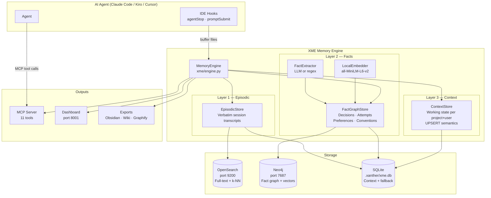
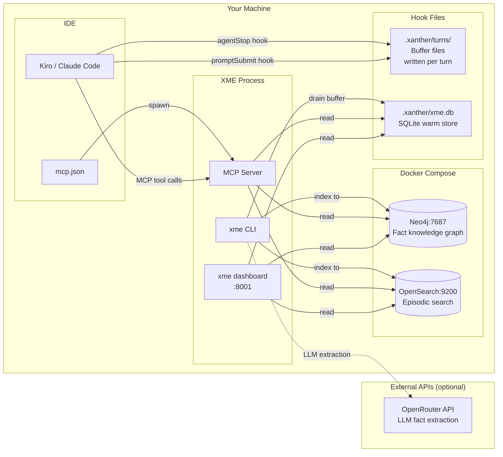
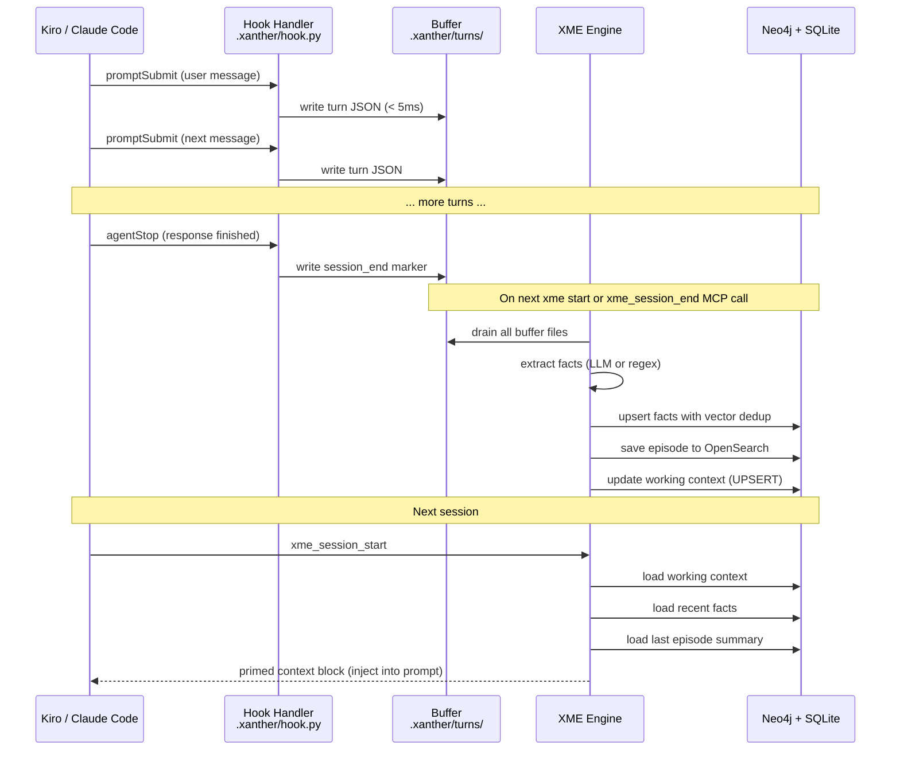
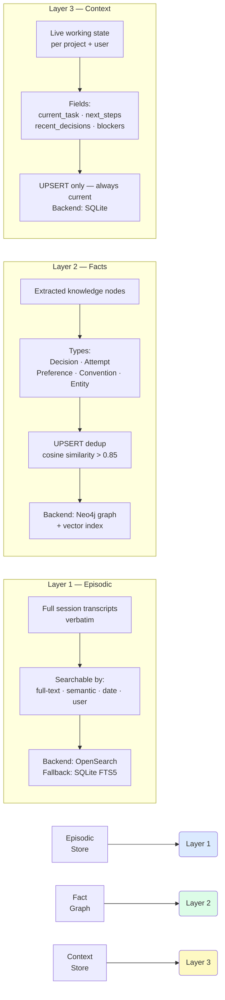
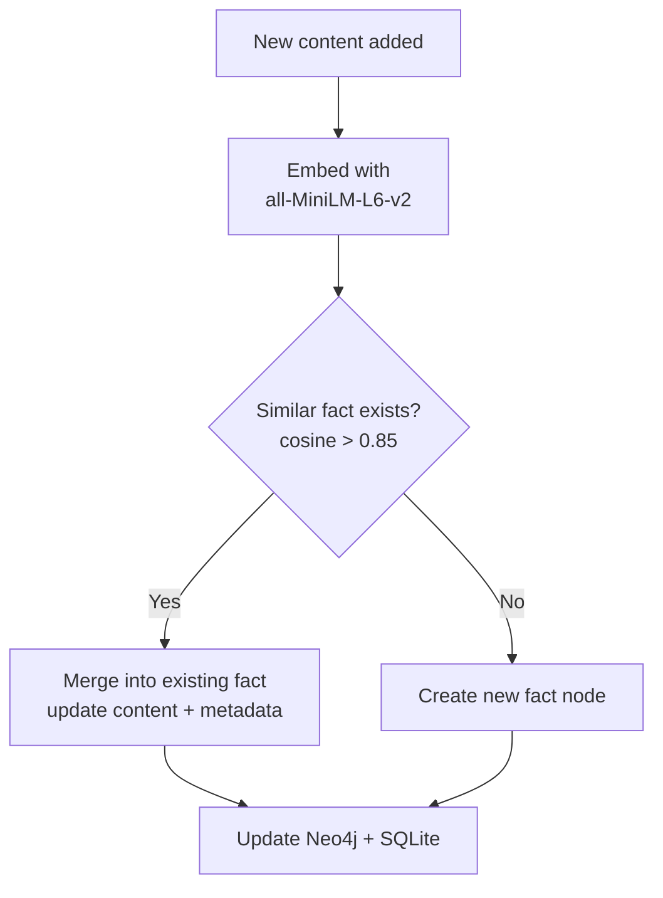

<div align="center">

# Xanther Memory Engine (XME)

**Persistent memory for AI coding assistants.**

[](LICENSE)
[](https://python.org)
[](https://pypi.org/project/xanther-xme)

</div>

---

> Your AI assistant forgets every decision you've made. It repeats the same failed approaches. It re-explains your stack every session. XME fixes this.

XME gives AI coding assistants **persistent memory** across sessions. Works with Claude Code, Kiro, Cursor, Codex, and any MCP-compatible tool. No cloud required.

```bash
pip install xanther-xme
xme hook install .      # 30 seconds — auto-captures every session
xme start my-project    # memory starts now
```

> **Want code intelligence too?** Install XME bundled with the [Xanther Context Engine (XCE)](https://github.com/Xanther-Ai/xanther-context-engine) in one command:
> ```bash
> pip install "xanther-xce[all]"        # XCE + XME together
> # or run instantly, no install:
> uvx --from "xanther-xce[all]" xanther --help
> ```

---

## Architecture



---

## Local Infrastructure



---

## Session lifecycle



---

## Three memory layers



---

## Getting Started

### 1. Install

```bash
pip install xanther-xme

# Or bundled with the Xanther Context Engine (code graph + memory):
pip install "xanther-xce[all]"
# Run instantly without installing:
uvx --from "xanther-xce[all]" xanther --help
```

### 2. Choose an infrastructure mode

XME works with or without Docker. Pick one:

**Zero infrastructure** — SQLite only, no Docker, works offline:
```bash
XME_FALLBACK_MODE=true xme start my-project
```

**Full infrastructure** — Neo4j (fact graph) + OpenSearch (episodic search):
```bash
cp .env.example .env        # set NEO4J_PASSWORD (and OPENROUTER_API_KEY for LLM extraction)
docker-compose up -d        # starts Neo4j (:7687) + OpenSearch (:9200)
xme start my-project
```

> No OpenRouter key? Fact extraction falls back to regex heuristics — everything still works,
> just with slightly coarser facts.

### 3. Install the auto-capture hooks

This is the step that makes memory automatic. Hooks capture every agent turn and persist a
session when the agent stops — no manual recording needed.

```bash
# Install Kiro + Claude Code hooks into a repo (defaults to current dir)
xme hook install .

# Preview what would be written without changing anything
xme hook install . --dry-run

# Remove the hooks later
xme hook uninstall .
```

**What gets installed:**

| Hook | IDE event | What it does |
|------|-----------|--------------|
| `xme-record-turn` | `promptSubmit` | Buffers each user turn to `.xanther/turns/` (<5ms, non-blocking) |
| `xme-record-tool` | `postToolUse` | Buffers tool calls to the same journal |
| `xme-session-end` | `agentStop` / `Stop` | Drains the buffer → extracts facts → updates context → saves the session |

The installer writes IDE-native config:
- **Kiro** → hook files under `.kiro/hooks/`
- **Claude Code** → hook entries in the project's Claude settings

### 4. Wire up the MCP server (optional but recommended)

So your agent can query and prime memory directly, add XME as an MCP server:

```json
{
  "mcpServers": {
    "xme": {
      "command": "xme",
      "args": ["serve"],
      "env": { "NEO4J_PASSWORD": "your-password" }
    }
  }
}
```

At the start of a session the agent calls `xme_session_start` to get a **primed context block**
(current task, recent decisions, known-failed approaches) injected into its prompt.

### 5. Verify it's working

```bash
xme stats my-project      # memory health: fact / episode / context counts
xme dashboard             # visual timeline at http://localhost:8001
```

After a session or two, `xme stats` should show growing fact and episode counts. If they stay at
zero, see **Troubleshooting hooks** below.

### Troubleshooting hooks

- **Nothing captured?** Confirm hooks installed: check `.kiro/hooks/` (Kiro) or your Claude Code
  settings. Re-run `xme hook install . --dry-run` to see expected paths.
- **Buffer never drains?** Facts are extracted on `agentStop` or on the next `xme start` /
  `xme_session_end` MCP call. Run `xme start my-project` to force a drain.
- **Neo4j errors?** You can run fully local with `XME_FALLBACK_MODE=true` (SQLite only).
- **Buffer files** live in `.xanther/turns/`; the warm store is `.xanther/xme.db`. Both are safe
  to inspect. Add `.xanther/` to your `.gitignore` (memory is per-developer runtime state).

---

## What gets captured automatically

After `xme hook install .`:

- Every prompt is buffered to `.xanther/turns/` (< 5ms, no blocking)
- On `agentStop`: buffer drains → facts extracted → context updated
- Next session: agent gets a primed context block injected automatically

```
**Current task**: Refactor auth module
**Last session**: Moved JWT to dedicated auth service — success
**Recent decisions**:
  - [VALIDATED] Use FastAPI — async support required
  - [VALIDATED] PostgreSQL — ACID compliance
**Known failed approaches**:
  - Redis distributed lock — timeout under high load
**Next steps**: Deploy auth service to staging
```

---

## MCP tools (11)

| Tool | Description |
|------|-------------|
| `xme_session_start` | Start session, get primed context block |
| `xme_session_end` | End session: persist episode, extract facts, update context |
| `xme_add` | Add content — Mem0-style UPSERT with deduplication |
| `xme_search` | Search across all 3 layers simultaneously |
| `xme_get_context` | Get working context for prompt injection |
| `xme_facts` | Query fact graph (filter by type, user, keyword) |
| `xme_episodes` | Full-text + semantic search over past sessions |
| `xme_remember` | Explicitly store a typed fact |
| `xme_forget` | Soft-delete a memory node |
| `xme_export` | Export to Obsidian vault / wiki / Graphify JSON |
| `xme_context_update` | Partial UPSERT of working context fields |

Add to MCP config:
```json
{
  "mcpServers": {
    "xme": {
      "command": "xme",
      "args": ["serve"],
      "env": {
        "NEO4J_PASSWORD": "your-password"
      }
    }
  }
}
```

---

## Deduplication

Facts are stored once, not repeated across sessions:



---

## Comparison

| | Mem0 | Zep | MemPalace | **XME** |
|--|------|-----|-----------|---------|
| Episodic memory | ✅ | ✅ | ✅ | ✅ |
| Fact graph | partial | ✅ | ❌ | ✅ |
| Working context UPSERT | ❌ | ❌ | ❌ | ✅ |
| Multi-user scoping | ✅ | ✅ | ❌ | ✅ |
| Deduplication | ✅ | ✅ | ❌ | ✅ |
| Local-first / open source | ❌ | ❌ | ✅ | ✅ |
| MCP tools | ❌ | ❌ | ❌ | ✅ (11) |
| Obsidian export | ❌ | ❌ | ❌ | ✅ |
| Dashboard UI | ❌ | ✅ | ❌ | ✅ |
| Code graph integration | ❌ | ❌ | ❌ | ✅ via XCE |

---

## CLI

```bash
xme start <project>              # init + show stats
xme add <project> <user> <text>  # add content to memory
xme search <project> <query>     # search all layers
xme facts <project>              # list facts
xme stats <project>              # memory health metrics
xme export <project>             # export (obsidian/wiki/graphify)
xme dashboard                    # launch web UI (port 8001)
xme hook install [path]          # install Kiro + Claude Code hooks
xme hook uninstall [path]        # remove hooks
```

---

## Configuration

```bash
# LLM for better fact extraction (optional — regex works without it)
OPENROUTER_API_KEY=sk-or-...
XME_LLM_MODEL=openai/gpt-4o-mini

# Neo4j — fact graph (recommended, free tier at console.neo4j.io)
NEO4J_URI=bolt://localhost:7687
NEO4J_PASSWORD=your-password

# OpenSearch — episodic search (optional, falls back to SQLite FTS5)
XME_OPENSEARCH_URL=http://localhost:9200

# Zero-infrastructure mode
XME_FALLBACK_MODE=false   # set true for SQLite-only, no Docker needed
```

See [`.env.example`](.env.example) for the complete reference.

---

## Related

[Xanther Context Engine (XCE)](https://github.com/Xanther-Ai/xanther-context-engine) — code graph intelligence. When installed alongside XME, decisions link directly to the code they affect.

```bash
pip install "xanther-context-engine[memory]"  # XCE + XME together
```

---

## License

Apache 2.0. See [LICENSE](LICENSE).
